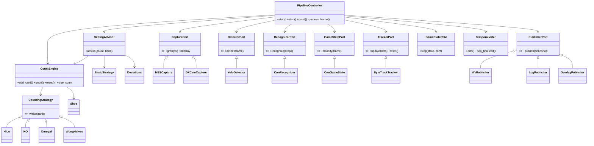
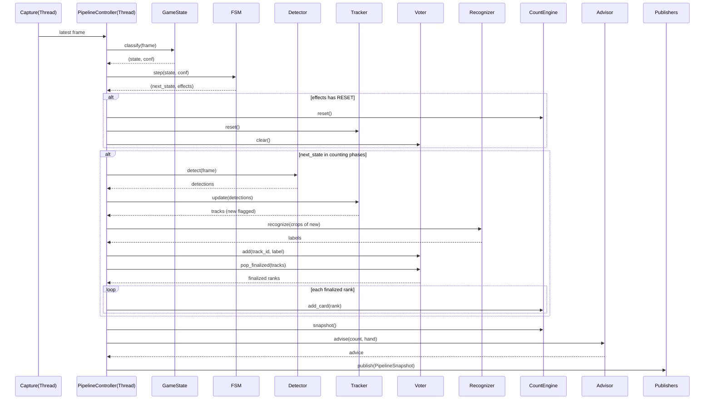
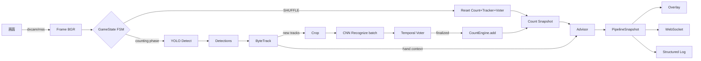
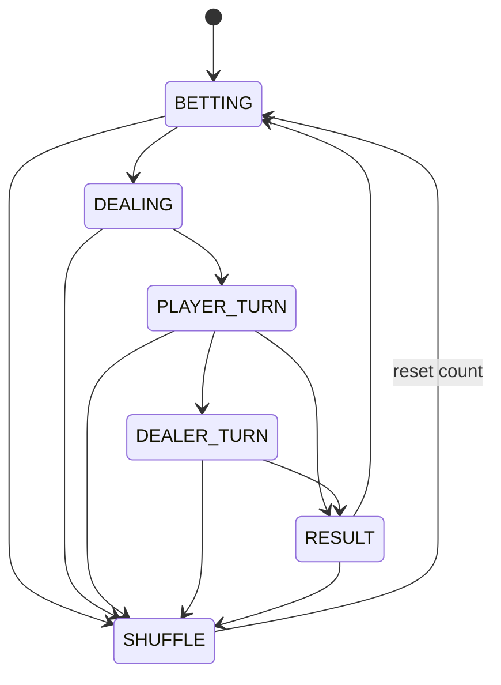

# ブラックジャック自動カウンティング AIシステム — 設計・実装指示書

> **対象**: Python によるコンピュータビジョン AI システム
> **目的**: 画面上のブラックジャックのカードを自動認識し、リアルタイムでカードカウンティングと戦略アドバイスを提示する
> **品質目標**: Google / Meta / OpenAI 水準の設計品質（保守性・拡張性・可読性を最優先）
> **バージョン**: 2.0
> **想定読者**: Claude Code（本書を基に、追加の設計判断なしで実装に着手できること）

---

## 目次

0. 前提・免責・スコープ
1. 設計原則（Design Tenets）
2. アーキテクチャ概観
3. 技術スタックと選定理由
4. ドメインモデル（Ubiquitous Language）
5. AIモデル構成と各モデルの責務
6. モジュール詳細とインターフェース契約（コード付き）
7. 依存性注入とレジストリ（拡張機構）
8. 状態機械（GameState FSM）の形式定義
9. 並行性・スレッドモデル
10. 認識信頼度・多数決・キャリブレーション
11. カウント理論とエンジン仕様
12. 戦略アドバイザ仕様
13. 学習方法（データ・拡張・訓練・評価）
14. 推論パイプライン詳細
15. フォルダ構成
16. 設定システム（Pydantic Settings）
17. API設計（REST / WebSocket）
18. クラス図 / シーケンス図 / データフロー / 状態遷移図
19. 観測性（ログ・メトリクス・トレース）
20. エラー処理・回復性（Resilience）
21. セキュリティ・プライバシー
22. テスト戦略
23. パフォーマンス最適化とGPU利用
24. MLOps（データ/モデルのバージョニングと配布）
25. CI/CD
26. コーディング規約・型・品質ゲート
27. Docker / デプロイ構成
28. requirements.txt / 依存管理
29. 将来の機能追加方法
30. 開発ロードマップ
- 付録A: Architecture Decision Records (ADR)
- 付録B: リスク登録簿
- 付録C: パフォーマンス・バジェット
- 付録D: 用語集

---

## 0. 前提・免責・スコープ

### 0.1 前提
- 本システムは **カードカウンティングの学習・練習用ツール** である。
- 対象は **無料の練習用ブラックジャック**（自作ゲーム、フリーゲーム、トレーニングサイト等）。**オンラインカジノ（実マネー賭博）は対象外**。
- カードカウンティングは数学的戦略であり違法行為ではない。本システムは **画面に表示された情報を読み取り人間に提示するだけの受動的ツール** であり、ゲームの自動操作・送金・サーバ通信の傍受・DOM改ざんは **行わない**。

### 0.2 スコープ（In / Out）
| In Scope | Out of Scope |
|----------|--------------|
| 画面キャプチャによるカード検出・認識 | 自動ベット/自動プレイ（bot操作） |
| Hi-Lo / KO / Omega II / Wong Halves 等のカウント | 実マネー取引・送金 |
| ベット・プレイ戦略アドバイスの**表示** | 特定サイトへのDOM注入・パケット傍受 |
| カウント結果のオーバーレイ表示 / API配信 | 利用規約で禁止される行為の補助 |
| データセット作成・モデル学習・評価 | — |

### 0.3 品質属性（優先順位順）
1. **正確性（Correctness）** — カウントの誤りは致命的。認識精度と二重カウント防止を最優先。
2. **保守性（Maintainability）** — 明確な責務分割、インターフェース駆動、テスト容易性。
3. **拡張性（Extensibility）** — 新カウント方式・新キャプチャ・新ゲームを最小変更で追加可能。
4. **可読性（Readability）** — 型ヒント完備、ドメイン語彙の一貫、自己文書化コード。
5. **性能（Performance）** — リアルタイム（10〜30 FPS、< 100ms/frame）。

---

## 1. 設計原則（Design Tenets）

> これらは全実装判断の最終的な拠り所。迷ったらこの順で従う。

1. **Correctness over cleverness** — 巧妙さより正しさ。カウントロジックは決定論的・純粋関数的に保ち、網羅テストする。
2. **Depend on abstractions, not concretions** — `PipelineController` は具象（YOLO, mss）に直接依存しない。すべて抽象基底クラス（ABC）＋DI経由。
3. **Pure core, imperative shell** — カウント/戦略の中核は副作用のない純粋ロジック。I/O（キャプチャ・GPU・ネットワーク）は外殻に隔離（Functional Core, Imperative Shell）。
4. **Make illegal states unrepresentable** — 列挙型・凍結データクラス・Pydanticで不正状態を型で排除する。
5. **Single source of truth for config** — 設定は1系統（Pydantic Settings）。マジックナンバー禁止。
6. **Observability is not optional** — すべての重要遷移は構造化ログ＋メトリクスを発火する。
7. **Fail loud in dev, degrade gracefully in prod** — 開発時は早期に例外、運用時は安全側に縮退（カウント停止・手動補正へ）。
8. **Type everything** — 100% 型ヒント、`mypy --strict` 通過を必須ゲートとする。
9. **Test the contract, not the implementation** — テストは公開インターフェースに対して書く。
10. **Reproducibility** — データ・モデル・乱数シードをバージョン管理し、結果を再現可能にする。

---

## 2. アーキテクチャ概観

### 2.1 レイヤードアーキテクチャ + Hexagonal（Ports & Adapters）

中核ドメイン（カウント・戦略）を外部技術（CV・キャプチャ・UI・ネットワーク）から分離する **ヘキサゴナルアーキテクチャ** を採用。

```
                    ┌─────────────────────────────────────┐
                    │          Driving Adapters            │
                    │   CLI │ REST API │ WebSocket │ UI     │
                    └───────────────┬─────────────────────┘
                                    │ (calls ports)
        ┌───────────────────────────▼──────────────────────────┐
        │                  Application Core                      │
        │  ┌──────────────────────────────────────────────┐    │
        │  │            PipelineController (Use Case)        │    │
        │  └──────────────────────────────────────────────┘    │
        │  ┌────────────────┐  ┌──────────────┐  ┌──────────┐  │
        │  │  Domain: Count  │  │ Domain: Shoe │  │ Advisor  │  │
        │  │  (pure logic)   │  │              │  │ (pure)   │  │
        │  └────────────────┘  └──────────────┘  └──────────┘  │
        │         ▲ Ports (ABCs): Capture, Detector,            │
        │         │ Recognizer, GameState, Tracker, Publisher    │
        └─────────┼─────────────────────────────────────────────┘
                  │ (implemented by)
        ┌─────────▼─────────────────────────────────────────────┐
        │                  Driven Adapters                       │
        │  mss/dxcam │ YOLO │ CNN/ONNX │ ByteTrack │ Loggers     │
        └────────────────────────────────────────────────────────┘
```

**要点**: ドメイン中核は `Port`（ABC）にのみ依存する。CV ライブラリや OS API はすべて Adapter として外側に隔離。これによりテスト時はモック Adapter を注入でき、技術スタックの差し替えがドメインに波及しない。

### 2.2 処理パイプライン（高レベル）
```
Capture → GameState判定 → Detection → Tracking → Recognition(新規のみ)
        → 多数決確定 → CountEngine反映 → Advisor → Publish(UI/API/Log)
```

詳細は §14・§18 を参照。

---

## 3. 技術スタックと選定理由

| 分類 | 採用 | 代替候補 | 選定理由 |
|------|------|----------|----------|
| 言語 | Python 3.11 | 3.12 | 型機能成熟・CVエコシステム・3.11はパフォーマンス改善版で安定 |
| 物体検出 | Ultralytics YOLOv8 (n/s) | YOLOX, RT-DETR | 学習容易・推論高速・ONNX/TensorRT変換が公式サポート |
| 分類 | PyTorch + timm | Keras | timm の軽量モデル（MobileNetV3）が豊富 |
| 追跡 | ByteTrack (`supervision`) | DeepSORT | 外観特徴不要で軽量、静的なカード追跡に十分 |
| 画面取得 | `dxcam`(Win) / `mss`(汎用) | PyAutoGUI | dxcam は DXGI で 60+FPS、mss はクロスプラット |
| 推論最適化 | ONNX Runtime / TensorRT | TorchScript | EP抽象で CPU/GPU 切替容易、TRTで FP16/INT8 |
| API | FastAPI + Uvicorn | Flask | 非同期・Pydantic統合・自動OpenAPI |
| UI | PyQt6 透過オーバーレイ | Tkinter, Electron | 透過・常時前面・クロスプラット |
| 設定 | Pydantic Settings + YAML | Hydra | 型安全・env上書き・ネスト対応 |
| ログ | structlog + loguru | logging | 構造化JSON・ローテーション |
| メトリクス | prometheus-client | statsd | プル型・標準 |
| テスト | pytest + hypothesis | unittest | プロパティベーステスト対応 |
| 依存管理 | uv (+ requirements.txt) | poetry | 高速・ロック再現性 |
| データ/モデル版管理 | DVC | git-lfs | データ/モデルのバージョニングとパイプライン |
| コンテナ | Docker + compose | — | 再現性 |
| 型/Lint | mypy --strict, ruff | flake8+black | 一体化・高速 |

---

## 4. ドメインモデル（Ubiquitous Language）

コード・ログ・ドキュメントで共通の語彙を用いる。

```python
# src/blackjack_counter/domain/types.py
from __future__ import annotations
from dataclasses import dataclass
from enum import Enum, IntEnum
from typing import NewType

class Rank(str, Enum):
    TWO = "2"; THREE = "3"; FOUR = "4"; FIVE = "5"; SIX = "6"
    SEVEN = "7"; EIGHT = "8"; NINE = "9"; TEN = "10"
    JACK = "J"; QUEEN = "Q"; KING = "K"; ACE = "A"

    @property
    def base_value(self) -> int:
        """ブラックジャックの素点（Aceは11、要文脈で1に調整）。"""
        if self in (Rank.JACK, Rank.QUEEN, Rank.KING, Rank.TEN):
            return 10
        if self is Rank.ACE:
            return 11
        return int(self.value)

class Suit(str, Enum):
    SPADE = "S"; HEART = "H"; DIAMOND = "D"; CLUB = "C"

@dataclass(frozen=True, slots=True)
class Card:
    rank: Rank
    suit: Suit
    def __str__(self) -> str:  # "AS", "10H"
        return f"{self.rank.value}{self.suit.value}"

@dataclass(frozen=True, slots=True)
class BBox:
    x1: float; y1: float; x2: float; y2: float
    @property
    def area(self) -> float: return max(0.0, self.x2 - self.x1) * max(0.0, self.y2 - self.y1)

@dataclass(frozen=True, slots=True)
class Detection:
    bbox: BBox
    confidence: float

@dataclass(frozen=True, slots=True)
class CardLabel:
    rank: Rank
    suit: Suit | None        # スートは戦略に不要なため Optional（認識軽量化可）
    confidence: float

TrackId = NewType("TrackId", int)

@dataclass(frozen=True, slots=True)
class Track:
    track_id: TrackId
    bbox: BBox
    confidence: float
    is_new: bool             # このフレームで初確定したか

class GameState(str, Enum):
    BETTING = "betting"
    DEALING = "dealing"
    PLAYER_TURN = "player_turn"
    DEALER_TURN = "dealer_turn"
    RESULT = "result"
    SHUFFLE = "shuffle"
    UNKNOWN = "unknown"
```

> **設計判断**: 全ドメイン値オブジェクトは `frozen=True, slots=True` の不変データクラス。これにより共有・ハッシュ・比較が安全になり、状態の意図せぬ変更を型レベルで防ぐ（原則4）。

---

## 5. AIモデル構成と各モデルの責務

3つのAIモデルを協調させる **マルチモデル・パイプライン**。各モデルは単一責務（SRP）。

### 5.1 モデル①: カード検出（Detector）
| 項目 | 内容 |
|------|------|
| 責務 | フレーム内の全カード位置（BBox）を検出。ランク/スート識別はしない。 |
| モデル | YOLOv8n（既定）/ YOLOv8s（高精度モード） |
| クラス | `card`（1クラス）。位置検出に特化し汎化性能を高める。 |
| 入力 | 640×640 RGB（レターボックス） |
| 出力 | `list[Detection]` |
| 主要指標 | **Recall 最優先**（カード取りこぼし＝カウント漏れは致命的）、mAP@0.5 > 0.99 |

### 5.2 モデル②: カード認識（Recognizer）
| 項目 | 内容 |
|------|------|
| 責務 | 切り出し画像から **ランク（13クラス）** を分類。スートはオプション（戦略不要）。 |
| モデル | MobileNetV3-Small（運用）/ ResNet18（検証） |
| 入力 | 128×128 RGB。**カード隅のインデックス領域クロップ**を併用し精度向上。 |
| 出力 | `CardLabel`（rank, suit?, confidence） |
| 主要指標 | Top-1 Acc > 0.995、混同行列で `6↔9`/`10↔他` の誤りを監視 |

### 5.3 モデル③: ゲーム状態分類（GameState Classifier）
| 項目 | 内容 |
|------|------|
| 責務 | 画面全体からフェーズ分類。**カウント反映タイミング制御**と**シャッフル検知→リセット**。 |
| クラス | `GameState`（7クラス） |
| モデル | MobileNetV3-Small（224×224） |
| 主要指標 | Macro-F1、**`shuffle` の Recall 最優先**（リセット漏れ防止） |

### 5.4 追跡（ByteTrack, モデルではないがコア）
- フレーム間で BBox に `TrackId` を付与し、**同一カードの二重カウントを防止**。
- 新規確定トラックのみ Recognizer へ送る（計算節約）。

> **将来の統合案（ADR-003参照）**: Detector を 52/13 クラスにして Recognizer を統合する単一モデル方式も可能。初期は分離方式で精度を確保し、後でベンチマークの上で統合を検討。

---

## 6. モジュール詳細とインターフェース契約（Ports）

すべてのI/O境界は ABC（Port）で定義。実装（Adapter）は §7 のレジストリで解決。

### 6.1 Capture Port
```python
# src/blackjack_counter/ports/capture.py
from abc import ABC, abstractmethod
import numpy as np
from blackjack_counter.domain.types import BBox

class CapturePort(ABC):
    """画面キャプチャの抽象。返り値は BGR の np.ndarray (H,W,3) uint8。"""

    @abstractmethod
    def grab(self, roi: BBox | None = None) -> np.ndarray:
        """指定ROI（None=全画面）の1フレームを取得。"""

    @abstractmethod
    def close(self) -> None: ...

    def __enter__(self) -> "CapturePort": return self
    def __exit__(self, *exc) -> None: self.close()
```

### 6.2 Vision Ports
```python
# src/blackjack_counter/ports/vision.py
from abc import ABC, abstractmethod
import numpy as np
from blackjack_counter.domain.types import Detection, CardLabel, GameState

class DetectorPort(ABC):
    @abstractmethod
    def detect(self, frame: np.ndarray) -> list[Detection]: ...

class RecognizerPort(ABC):
    @abstractmethod
    def recognize(self, crops: list[np.ndarray]) -> list[CardLabel]:
        """バッチ認識（GPU効率のためリスト入力）。"""

class GameStatePort(ABC):
    @abstractmethod
    def classify(self, frame: np.ndarray) -> tuple[GameState, float]: ...

class TrackerPort(ABC):
    @abstractmethod
    def update(self, detections: list[Detection]) -> list["Track"]: ...
    @abstractmethod
    def reset(self) -> None: ...
```

### 6.3 Publisher Port（出力先抽象）
```python
# src/blackjack_counter/ports/publisher.py
from abc import ABC, abstractmethod
from blackjack_counter.domain.snapshot import PipelineSnapshot

class PublisherPort(ABC):
    """カウント状態・助言・検出結果を購読者へ配信。"""
    @abstractmethod
    def publish(self, snapshot: PipelineSnapshot) -> None: ...
```

### 6.4 不変スナップショット（出力DTO）
```python
# src/blackjack_counter/domain/snapshot.py
from dataclasses import dataclass
from blackjack_counter.domain.types import CardLabel, GameState

@dataclass(frozen=True, slots=True)
class CountSnapshot:
    running_count: float
    true_count: float
    remaining_decks: float
    cards_seen: int
    strategy: str

@dataclass(frozen=True, slots=True)
class AdviceSnapshot:
    bet_units: int
    bet_label: str
    play_action: str | None
    deviation_applied: bool

@dataclass(frozen=True, slots=True)
class PipelineSnapshot:
    timestamp: float
    state: GameState
    count: CountSnapshot
    advice: AdviceSnapshot
    detected: tuple[CardLabel, ...]
    fps: float
```

> **設計判断**: 出力は単一の不変 `PipelineSnapshot` に集約。UI/API/ログは同一スナップショットを受けるため、表示の不整合が構造的に起こり得ない（Single Source of Truth）。

---

## 7. 依存性注入とレジストリ（拡張機構）

新しい実装を**コード本体を変更せず**追加できるよう、文字列キー→ファクトリのレジストリを用いる。

```python
# src/blackjack_counter/registry.py
from typing import Callable, TypeVar, Generic

T = TypeVar("T")

class Registry(Generic[T]):
    def __init__(self, kind: str) -> None:
        self._kind = kind
        self._factories: dict[str, Callable[..., T]] = {}

    def register(self, name: str) -> Callable[[Callable[..., T]], Callable[..., T]]:
        def deco(factory: Callable[..., T]) -> Callable[..., T]:
            if name in self._factories:
                raise ValueError(f"{self._kind} '{name}' already registered")
            self._factories[name] = factory
            return factory
        return deco

    def create(self, name: str, **kwargs) -> T:
        if name not in self._factories:
            raise KeyError(f"unknown {self._kind}: {name!r}. "
                           f"available: {sorted(self._factories)}")
        return self._factories[name](**kwargs)

# グローバルレジストリ
CAPTURE_REGISTRY: Registry = Registry("capture")
DETECTOR_REGISTRY: Registry = Registry("detector")
STRATEGY_REGISTRY: Registry = Registry("counting_strategy")
PUBLISHER_REGISTRY: Registry = Registry("publisher")
```

使用例（新キャプチャ追加はこれだけ）:
```python
# src/blackjack_counter/adapters/capture/dxcam_capture.py
from blackjack_counter.registry import CAPTURE_REGISTRY
from blackjack_counter.ports.capture import CapturePort

@CAPTURE_REGISTRY.register("dxcam")
class DXCamCapture(CapturePort):
    def __init__(self, monitor: int = 1) -> None: ...
    def grab(self, roi=None): ...
    def close(self): ...
```

コンポジションルート（依存配線の唯一の場所）:
```python
# src/blackjack_counter/composition.py
from blackjack_counter.config import Settings
from blackjack_counter.registry import CAPTURE_REGISTRY, DETECTOR_REGISTRY
from blackjack_counter.pipeline.controller import PipelineController

def build_controller(settings: Settings) -> PipelineController:
    capture = CAPTURE_REGISTRY.create(settings.capture.backend,
                                      monitor=settings.capture.monitor)
    detector = DETECTOR_REGISTRY.create(settings.vision.detector.kind,
                                        cfg=settings.vision.detector)
    # ... recognizer, gamestate, tracker, counter, advisor, publishers
    return PipelineController(capture=capture, detector=detector, ...)
```

> **原則**: アプリ全体で `new`（具象生成）が許されるのは `composition.py` のみ。他の層は注入された Port にのみ依存する（原則2）。

---

## 8. 状態機械（GameState FSM）の形式定義

カウント反映のタイミングとリセットを **明示的な有限状態機械** で管理する。曖昧な if 連鎖を排除し、遷移を1か所に集約する。

### 8.1 状態と遷移
```
states  = {BETTING, DEALING, PLAYER_TURN, DEALER_TURN, RESULT, SHUFFLE}
events  = AI が分類した GameState（信頼度付き）

許可遷移（それ以外は無視 = ノイズとみなす）:
  BETTING      → DEALING
  DEALING      → PLAYER_TURN
  PLAYER_TURN  → DEALER_TURN | RESULT
  DEALER_TURN  → RESULT
  RESULT       → BETTING | SHUFFLE
  *            → SHUFFLE        （シャッフルはどこからでも検知）
  SHUFFLE      → BETTING

副作用:
  enter SHUFFLE  : CountEngine.reset()  （running count を 0 に）
  enter DEALING  : round-local 一時状態クリア（確定カード集合は維持）
  enter RESULT   : ラウンドの手札カードを「確定済み」へ移行
```

### 8.2 実装方針
- 状態遷移表を辞書で持ち、`transition(current, event_state, conf) -> (next_state, side_effects)` の純粋関数で表現。
- **ヒステリシス**: 状態変更には N フレーム連続で同一状態かつ `conf > 閾値` を要求（チャタリング防止）。
- 不許可遷移は遷移せず `WARNING` ログ（`illegal_transition`）。

```python
# src/blackjack_counter/pipeline/fsm.py
ALLOWED: dict[GameState, set[GameState]] = {
    GameState.BETTING:     {GameState.DEALING, GameState.SHUFFLE},
    GameState.DEALING:     {GameState.PLAYER_TURN, GameState.SHUFFLE},
    GameState.PLAYER_TURN: {GameState.DEALER_TURN, GameState.RESULT, GameState.SHUFFLE},
    GameState.DEALER_TURN: {GameState.RESULT, GameState.SHUFFLE},
    GameState.RESULT:      {GameState.BETTING, GameState.SHUFFLE},
    GameState.SHUFFLE:     {GameState.BETTING},
}
```

---

## 9. 並行性・スレッドモデル

リアルタイム性確保のため、I/O と推論を分離する **プロデューサ/コンシューマ** 構成。

```
[Capture Thread] --(latest frame, ring buffer size=1)--> [Inference Thread]
[Inference Thread] --(snapshot queue)--> [Publish Thread(s)]
```

- **Capture Thread**: 最新フレームのみ保持するサイズ1のリングバッファに書き込む（古いフレームは破棄＝レイテンシ最小化）。
- **Inference Thread**: GPU 推論を直列実行（GPUは1ストリームが基本）。最新フレームを取り、パイプラインを回す。
- **Publish Thread**: スナップショットを UI/API/ログへ非同期配信。
- スレッド間共有は `queue.Queue`（境界付き）と `threading.Event`（停止フラグ）。
- 共有可変状態は持たず、不変 `PipelineSnapshot` を受け渡す（データ競合の構造的排除）。
- GIL の影響: 推論本体は C 拡張（PyTorch/ORT）内で GIL を解放するため、キャプチャと推論の並行は有効。CPUバウンドな前処理が重い場合は `ProcessPoolExecutor` を検討（ADR-005）。

---

## 10. 認識信頼度・多数決・キャリブレーション

カウントの正確性を担保する中核。単一フレームの認識を鵜呑みにしない。

### 10.1 マルチフレーム多数決（Temporal Voting）
- 各 `TrackId` について、トラックが安定するまで複数フレームの認識結果を集める。
- トラック消滅（手札確定）時または K フレーム蓄積時に **最頻ランクを多数決** で確定。
- タイブレークは平均信頼度。確定後はそのトラックを「確定済み集合」に入れ、再カウントしない。

```python
# 概念
votes: dict[TrackId, Counter[Rank]] = ...
def finalize(track_id) -> Rank:
    counter = votes[track_id]
    return counter.most_common(1)[0][0]
```

### 10.2 信頼度キャリブレーション
- モデルの softmax は過信しがち → **温度スケーリング**（temperature scaling）で校正し、閾値判断を信頼できる確率に基づかせる。
- 校正後の `conf < threshold` のカードは **確定保留**＋ `low_confidence` ログ＋（UIで）手動補正を促す。

### 10.3 安全側縮退
- 同一トラックで認識が割れ続ける／低信頼が続く場合、自動確定せず **手動補正API（§17）** にフォールバック。「誤カウントするより、人に確認させる」方針（原則7）。

---

## 11. カウント理論とエンジン仕様

### 11.1 カウント方式（Strategy パターン）
```python
# src/blackjack_counter/counting/strategies.py
from abc import ABC, abstractmethod
from blackjack_counter.domain.types import Rank
from blackjack_counter.registry import STRATEGY_REGISTRY

class CountingStrategy(ABC):
    name: str
    balanced: bool                 # True=balanced(true count必要), False=unbalanced(KO等)
    @abstractmethod
    def value(self, rank: Rank) -> float: ...
    @property
    @abstractmethod
    def initial_running_count_per_deck(self) -> float:
        """unbalanced方式の開始IRC補正（balancedは0）。"""

@STRATEGY_REGISTRY.register("hi_lo")
class HiLo(CountingStrategy):
    name = "Hi-Lo"; balanced = True
    _MAP = {Rank.TWO:1, Rank.THREE:1, Rank.FOUR:1, Rank.FIVE:1, Rank.SIX:1,
            Rank.SEVEN:0, Rank.EIGHT:0, Rank.NINE:0,
            Rank.TEN:-1, Rank.JACK:-1, Rank.QUEEN:-1, Rank.KING:-1, Rank.ACE:-1}
    def value(self, rank): return self._MAP[rank]
    @property
    def initial_running_count_per_deck(self): return 0.0
```
- 同様に `KO`（unbalanced, 7も+1）、`OmegaII`（多レベル）、`WongHalves`（小数値）を追加可能。**エンジン本体は無変更**で設定文字列により切替（拡張性）。

### 11.2 Shoe（残デッキ管理）
```python
# src/blackjack_counter/counting/shoe.py
@dataclass
class Shoe:
    num_decks: int
    cards_dealt: int = 0
    @property
    def total_cards(self) -> int: return self.num_decks * 52
    @property
    def remaining_cards(self) -> int: return self.total_cards - self.cards_dealt
    @property
    def remaining_decks(self) -> float: return max(self.remaining_cards / 52.0, 1e-9)
    @property
    def penetration(self) -> float: return self.cards_dealt / self.total_cards
```

### 11.3 CountEngine（純粋・決定論的）
```python
# src/blackjack_counter/counting/engine.py
class CountEngine:
    def __init__(self, strategy: CountingStrategy, num_decks: int) -> None:
        self._strategy = strategy
        self._shoe = Shoe(num_decks)
        self._running_count = strategy.initial_running_count_per_deck * num_decks
        self._history: list[Rank] = []

    def add_card(self, rank: Rank) -> None:
        self._running_count += self._strategy.value(rank)
        self._shoe.cards_dealt += 1
        self._history.append(rank)

    def undo(self) -> None:
        if not self._history: return
        rank = self._history.pop()
        self._running_count -= self._strategy.value(rank)
        self._shoe.cards_dealt -= 1

    def reset(self) -> None:
        n = self._shoe.num_decks
        self._shoe = Shoe(n)
        self._running_count = self._strategy.initial_running_count_per_deck * n
        self._history.clear()

    @property
    def running_count(self) -> float: return self._running_count

    @property
    def true_count(self) -> float:
        if not self._strategy.balanced:
            return self._running_count        # unbalanced は RC をそのまま使う
        return self._running_count / self._shoe.remaining_decks

    def snapshot(self) -> CountSnapshot: ...
```
> **設計判断**: `CountEngine` は I/O・乱数・時刻に一切依存しない純粋ロジック。これにより `hypothesis` による網羅的プロパティテスト（例: 「全カードを出すと balanced 方式の RC は 0 に戻る」）が可能（原則3・原則9）。

---

## 12. 戦略アドバイザ仕様

### 12.1 基本戦略（Basic Strategy）
- ハードハンド/ソフトハンド/スプリットの行動表をルール別（S17/H17, DAS, サレンダー有無）にデータで保持。
- `action(player_total, is_soft, dealer_upcard, can_split, can_double) -> Action`。

### 12.2 カウント偏差（Deviations）
- **Illustrious 18 / Fab 4** 等、true count に応じて基本戦略を逸脱する規則をデータ駆動で保持。
- 例: 「16 vs 10 は TC ≥ 0 で Stand」。`use_deviations=false` で無効化可能。

### 12.3 ベットスプレッド
- true count → ベットユニットのマッピング（設定 `counting.bet_spread`）。
- 出力 `AdviceSnapshot` に `bet_units`・`bet_label`・`play_action`・`deviation_applied` を格納。

```python
class BettingAdvisor:
    def advise(self, count: CountSnapshot, hand: HandContext | None) -> AdviceSnapshot: ...
```
> アドバイザも純粋関数。プレイ判断は `play_action`、賭け判断は `bet_units` に分離（SRP）。

---

## 13. 学習方法

### 13.1 データセット
| 種別 | 説明 | 量（目安） | フォーマット |
|------|------|-----------|-------------|
| 合成 | カード素材を背景・角度・照度・遮蔽でドメインランダム化合成 | 50,000 | YOLO(検出)/ImageFolder(分類) |
| 実画面 | 対象ゲームのスクショをアノテーション | 2,000〜5,000 | 同上 |
| 状態 | フェーズ別フルフレーム | クラス毎 1,000+ | ImageFolder |
| ホールドアウト | 実画面の20% | — | — |

- アノテーション: Label Studio / CVAT / Roboflow。
- 合成生成: `scripts/generate_synthetic.py`（透視変換・遮蔽・影・モーションブラー・色ジッタ）。

### 13.2 データ拡張（Albumentations）
`RandomBrightnessContrast, HueSaturationValue, MotionBlur, GaussNoise, Perspective, CoarseDropout(遮蔽), RandomShadow`。カード隅インデックスが消えない範囲のクロップ拡張。

### 13.3 学習手順
```bash
# ① 検出
yolo detect train data=configs/cards_det.yaml model=yolov8n.pt \
    epochs=100 imgsz=640 batch=32 device=0 seed=42

# ② 認識（分類）
python -m blackjack_counter.training.train_classifier --config configs/recognizer.yaml

# ③ 状態分類
python -m blackjack_counter.training.train_gamestate --config configs/gamestate.yaml
```
- 転移学習・AMP・コサインアニーリング・早期終了（patience=10）・固定シード。
- 実験管理: MLflow（パラメータ/メトリクス/アーティファクト記録）。

### 13.4 評価
- 検出: mAP@0.5 / @0.5:0.95、PR曲線、誤検出/未検出フレーム可視化。
- 認識: Top-1 Acc、混同行列、温度スケーリング後のキャリブレーション誤差（ECE）。
- **E2E カウント精度（最重要）**: 既知配札シーケンス（fixtures）を再生し、最終 RC が正解一致するか。

---

## 14. 推論パイプライン詳細

```python
# src/blackjack_counter/pipeline/controller.py（要旨）
class PipelineController:
    def __init__(self, *, capture, detector, recognizer, gamestate,
                 tracker, counter, advisor, publishers, voter, fsm, cfg): ...

    def _process_frame(self, frame) -> PipelineSnapshot:
        state, sconf = self._gamestate.classify(frame)
        next_state, effects = self._fsm.step(state, sconf)
        for eff in effects:
            if eff is Effect.RESET_COUNT:
                self._counter.reset(); self._tracker.reset(); self._voter.clear()

        if next_state in COUNTING_PHASES:
            dets = self._detector.detect(frame)
            tracks = self._tracker.update(dets)
            new_tracks = [t for t in tracks if t.is_new]
            if new_tracks:
                crops = [crop(frame, t.bbox) for t in new_tracks]
                labels = self._recognizer.recognize(crops)
                for t, lab in zip(new_tracks, labels):
                    self._voter.add(t.track_id, lab)

            for tid, rank in self._voter.pop_finalized(tracks):
                self._counter.add_card(rank)

        count = self._counter.snapshot()
        advice = self._advisor.advise(count, self._hand_context(tracks))
        return PipelineSnapshot(state=next_state, count=count, advice=advice, ...)
```

最適化要点（詳細は §23）:
- 検出は毎フレーム、認識は**新規トラックのみ＋バッチ**。
- `BETTING`/`RESULT` 中は検出を低頻度化。
- 前処理は GPU 上（torchvision transforms on cuda）。

---

## 15. フォルダ構成

```
blackjack-counter-ai/
├── README.md
├── pyproject.toml                # ビルド/ツール設定(ruff,mypy,pytest)
├── requirements.txt
├── requirements-dev.txt
├── .env.example
├── .pre-commit-config.yaml
├── dvc.yaml                      # データ/モデルのパイプライン定義
├── Makefile                      # 開発タスク(lint,test,train,run)
├── docker/
│   ├── Dockerfile                # CPU
│   ├── Dockerfile.gpu            # CUDA
│   └── docker-compose.yml
├── configs/
│   ├── default.yaml
│   ├── cards_det.yaml
│   ├── recognizer.yaml
│   └── gamestate.yaml
├── models/                       # 学習済み重み (DVC管理, .gitignore)
├── data/                         # データセット (DVC管理, .gitignore)
├── src/
│   └── blackjack_counter/
│       ├── __init__.py
│       ├── app.py                # エントリポイント(CLI)
│       ├── composition.py        # 依存配線（唯一のnew許可箇所）
│       ├── config.py             # Pydantic Settings
│       ├── registry.py
│       ├── domain/               # 純粋ドメイン（外部依存ゼロ）
│       │   ├── types.py
│       │   └── snapshot.py
│       ├── ports/                # 抽象(ABC)
│       │   ├── capture.py
│       │   ├── vision.py
│       │   └── publisher.py
│       ├── adapters/             # 具象実装（Portを実装）
│       │   ├── capture/{mss_capture.py, dxcam_capture.py}
│       │   ├── detector/{yolo_detector.py}
│       │   ├── recognizer/{cnn_recognizer.py}
│       │   ├── gamestate/{cnn_gamestate.py}
│       │   ├── tracker/{bytetrack_tracker.py}
│       │   └── publisher/{ws_publisher.py, log_publisher.py, overlay_publisher.py}
│       ├── counting/{strategies.py, engine.py, shoe.py, voter.py}
│       ├── advisor/{basic_strategy.py, deviations.py, advisor.py}
│       ├── pipeline/{controller.py, fsm.py, runtime.py}
│       ├── api/{server.py, routes.py, schemas.py, deps.py}
│       ├── ui/{overlay.py, region_selector.py}
│       ├── training/{train_classifier.py, train_gamestate.py, datamodule.py, augment.py}
│       └── utils/{logging.py, metrics.py, geometry.py, calibration.py}
├── scripts/{generate_synthetic.py, export_onnx.py, benchmark.py, annotate_helper.py}
└── tests/{conftest.py, unit/, integration/, property/, fixtures/}
```

> **構造の意図**: `domain` は何にも依存しない最内層。`ports` が抽象、`adapters` が具象。依存方向は常に「外→内」（依存性逆転の原則）。これにより CV ライブラリの更新がドメインに波及しない。

---

## 16. 設定システム（Pydantic Settings）

型安全・env上書き・ネスト対応。`configs/default.yaml`（§旧13と同等）に加え、コードでスキーマを定義。

```python
# src/blackjack_counter/config.py
from pydantic import BaseModel, Field
from pydantic_settings import BaseSettings, SettingsConfigDict

class DetectorCfg(BaseModel):
    kind: str = "yolo"
    weights: str = "models/detector.onnx"
    imgsz: int = 640
    conf_threshold: float = Field(0.45, ge=0, le=1)
    iou_threshold: float = Field(0.5, ge=0, le=1)
    device: str = "cuda:0"

class RecognizerCfg(BaseModel):
    kind: str = "cnn"
    weights: str = "models/recognizer.onnx"
    input_size: int = 128
    conf_threshold: float = Field(0.90, ge=0, le=1)
    num_classes: int = 13

class VisionCfg(BaseModel):
    detector: DetectorCfg = DetectorCfg()
    recognizer: RecognizerCfg = RecognizerCfg()
    # gamestate, tracker ...

class CountingCfg(BaseModel):
    strategy: str = "hi_lo"
    num_decks: int = Field(6, ge=1, le=8)
    penetration_reset: float = Field(0.75, gt=0, lt=1)
    vote_frames: int = Field(5, ge=1)

class Settings(BaseSettings):
    model_config = SettingsConfigDict(
        env_prefix="BJC_", env_nested_delimiter="__",
        yaml_file="configs/default.yaml")
    vision: VisionCfg = VisionCfg()
    counting: CountingCfg = CountingCfg()
    # capture, advisor, api, ui ...

    @classmethod
    def load(cls, path: str | None = None) -> "Settings": ...
```
- 起動時に **設定をバリデーション**（範囲・整合性）し、不正なら起動失敗（fail loud）。
- env での上書き例: `BJC_VISION__DETECTOR__DEVICE=cpu`。

---

## 17. API設計（REST / WebSocket）

### 17.1 REST（`/v1` プレフィックス、後方互換のためバージョニング）
| Method | Path | 説明 | レスポンス |
|--------|------|------|-----------|
| GET | `/v1/health` | ヘルス | `{status, version}` |
| GET | `/v1/ready` | 依存(モデルロード済)確認 | `{ready: bool}` |
| POST | `/v1/session/start` | セッション開始(decks,strategy) | `SessionDTO` |
| POST | `/v1/session/reset` | カウントリセット | `CountStateDTO` |
| POST | `/v1/session/stop` | 停止 | `{stopped}` |
| GET | `/v1/count` | 現在カウント | `CountStateDTO` |
| GET | `/v1/advice` | 現在助言 | `AdviceDTO` |
| GET | `/v1/config` | 設定取得 | `ConfigDTO` |
| PATCH | `/v1/config` | 設定変更(strategy,roi,閾値) | `ConfigDTO` |
| POST | `/v1/card/manual` | 手動カード追加(補正) | `CountStateDTO` |
| POST | `/v1/card/undo` | 直近取消 | `CountStateDTO` |
| GET | `/metrics` | Prometheus メトリクス | text |

### 17.2 WebSocket
| Path | 説明 |
|------|------|
| `WS /v1/stream` | `PipelineSnapshot` を 10〜30Hz で push |

### 17.3 スキーマ・規約
- リクエスト/レスポンスは Pydantic DTO。ドメイン型と分離（API契約とドメインを疎結合に）。
- エラーは RFC 7807（Problem Details）形式 `{type, title, status, detail}`。
- 認証: ローカル用途は無し、ネットワーク公開時は APIキー（`X-API-Key`）をオプションで。

---

## 18. 図（クラス / シーケンス / データフロー / 状態遷移）

### 18.1 クラス図


### 18.2 シーケンス図（1フレーム）


### 18.3 データフロー


### 18.4 状態遷移図


---

## 19. 観測性（ログ・メトリクス・トレース）

### 19.1 構造化ログ（structlog → JSON）
| event | フィールド | レベル |
|-------|-----------|--------|
| `card_confirmed` | track_id, rank, conf, running_count | INFO |
| `count_update` | running_count, true_count, remaining_decks | INFO |
| `state_transition` | from, to, conf | INFO |
| `illegal_transition` | from, attempted, conf | WARNING |
| `shoe_reset` | reason, prev_count | INFO |
| `low_confidence` | bbox, top1, top2, conf | WARNING |
| `inference_latency` | stage, ms | DEBUG |
| `pipeline_error` | exc_type, traceback | ERROR |

- 相関ID（`frame_id`, `round_id`）を全ログに付与しトレース可能に。
- ローテーション: 日次＋サイズ上限、保持30日（loguru）。

### 19.2 メトリクス（Prometheus、`/metrics`）
- `bjc_fps`（gauge）、`bjc_inference_latency_ms{stage}`（histogram）、`bjc_recognition_confidence`（histogram）、`bjc_cards_counted_total`（counter）、`bjc_low_confidence_total`（counter）、`bjc_state`（gauge enum）。

### 19.3 トレース（任意）
- OpenTelemetry で各 stage をスパン化。Grafana/Tempo 連携可。

---

## 20. エラー処理・回復性（Resilience）

| 障害 | 検知 | 対応 |
|------|------|------|
| キャプチャ失敗（ウィンドウ消失等） | `grab` 例外 | バックオフ再試行→継続失敗で安全停止＋通知 |
| モデルロード失敗 | 起動時 | fail fast（起動中止、明示エラー） |
| GPU OOM | 推論例外 | バッチ縮小→CPUフォールバック→縮退モード |
| 認識が割れ続ける | Voter不確定継続 | 自動確定せず手動補正へフォールバック |
| 状態の誤分類によるリセット暴発 | ヒステリシス＋許可遷移 | 不許可遷移を無視・WARNINGログ |
| パイプライン例外 | try/except 包囲 | フレームをスキップしログ、ループ継続（1フレーム失敗で全体停止させない） |

- 設計原則: **「誤ったカウントを出すより、カウントを止めて人に知らせる」**（原則1・7）。

---

## 21. セキュリティ・プライバシー

- **ローカル処理が既定**: 画面データは外部送信しない。クラウド推論はオプトインのみ。
- API をネットワーク公開する場合: APIキー認証、CORS 制限、レート制限、`0.0.0.0` バインドは明示設定時のみ。
- スクリーンショット/ログに個人情報が写り込む可能性 → ログのスクショ保存は既定オフ、保存時はローカルのみ・自動削除ポリシー。
- 依存パッケージ脆弱性スキャン（`pip-audit`）を CI に組み込む。
- 秘密情報は `.env`（gitignore）／環境変数のみ。コード・ログに出力しない。
- **悪用防止**: 本ツールはオンラインカジノ（実賭博）の利用規約違反を助長しない設計（自動操作機能を持たない）。

---

## 22. テスト戦略

### 22.1 テストピラミッド
- **Unit（多数・高速）**: 純粋ロジック（counting, advisor, fsm, voter, config）。
- **Property-based（hypothesis）**: 不変条件を網羅検証。
- **Integration**: 録画フレーム列の再生で E2E カウント一致。
- **API**: `httpx.AsyncClient`。
- **Contract**: 各 Port のモック実装が契約（型・例外）を満たすか。

### 22.2 プロパティテスト例
```python
from hypothesis import given, strategies as st

@given(st.lists(st.sampled_from(list(Rank))))
def test_hilo_full_deck_returns_to_zero_balanced(ranks):
    eng = CountEngine(HiLo(), num_decks=1)
    for r in ranks: eng.add_card(r)
    for _ in ranks: eng.undo()
    assert eng.running_count == 0          # add→undo は恒等

@given(st.integers(1, 8))
def test_remaining_decks_positive(n):
    assert Shoe(n).remaining_decks > 0
```

### 22.3 ゴールデンテスト（E2E）
```
tests/fixtures/sequences/shoe_001.json   # 配札列＋期待 final running_count
tests/integration/test_pipeline_replay.py # フレーム列→Controller→カウント検証
```

### 22.4 カバレッジ目標
- `counting/` `advisor/` `pipeline/fsm.py`: **> 95%**
- 全体: **> 85%**
- CI ゲート: カバレッジ低下で fail。

---

## 23. パフォーマンス最適化とGPU利用

### 23.1 最適化施策
| 施策 | 効果 |
|------|------|
| ONNX Runtime + CUDA EP | 2〜4倍高速 |
| TensorRT FP16/INT8（本番GPU） | さらに高速・低メモリ |
| キャプチャ/推論スレッド分離＋size1リングバッファ | レイテンシ最小化 |
| 認識は新規トラックのみ＋バッチ推論 | GPU効率最大化 |
| `dxcam`(DXGI) | キャプチャ60+FPS |
| `BETTING`/`RESULT` 中の検出低頻度化 | 無駄推論削減 |
| 前処理を GPU 上で実施 | CPU↔GPU転送削減 |
| `torch.inference_mode()`・モデルシングルトン | 再ロード/勾配計算回避 |
| INT8 PTQ・MobileNet 採用 | CPU環境でも実用速度 |

### 23.2 GPU利用
- 学習: CUDA + AMP、マルチGPUは YOLO `device=0,1` / DDP。
- 推論: ONNX(CUDAExecutionProvider) → 本番は TensorRT(FP16)。
- デバイス選択は設定 `*.device`。CUDA非搭載は自動 CPU フォールバック（起動時 `torch.cuda.is_available()` 判定＋ログ）。
- メモリ: シングルトンロード、`inference_mode`、CUDAキャッシュ定期解放。

### 23.3 性能目標（付録C参照）
RTX 3060 クラスで **合計 < 30ms/frame（30+ FPS）**。回帰検知は `scripts/benchmark.py` を CI（GPUランナー時）で実行。

---

## 24. MLOps（データ/モデルのバージョニングと配布）

- **DVC**: `data/`・`models/` をバージョン管理。`dvc.yaml` で「合成生成→学習→ONNX変換→評価」をパイプライン化し再現可能に。
- **モデルレジストリ**: モデルに `model_card.md`（学習データ・指標・既知の限界・バージョン）を添付。`models/manifest.yaml` で重みのバージョン・チェックサム・対応ゲームを管理。
- **再現性**: 乱数シード固定、依存ロック、学習設定（YAML）をコミット。
- **モデル昇格フロー**: `dev → staging（E2E閾値クリア）→ prod`。E2Eカウント精度が基準未満なら昇格不可。
- **ドリフト監視**: 運用時の `low_confidence` 率・状態誤分類率を監視し、閾値超で再学習トリガ。

---

## 25. CI/CD

`.github/workflows/ci.yml`（要旨）:
```yaml
jobs:
  quality:
    steps:
      - ruff check . && ruff format --check .
      - mypy --strict src
      - pip-audit
  test:
    steps:
      - pytest --cov=blackjack_counter --cov-fail-under=85
  build:
    steps:
      - docker build -f docker/Dockerfile .
```
- PR ゲート: lint・型・テスト・カバレッジ・脆弱性スキャンを全て通過必須。
- 任意: GPU セルフホストランナーで `benchmark.py` 回帰チェック・E2E。
- リリース: タグ push で Docker イメージを GHCR へ publish、SemVer。

---

## 26. コーディング規約・型・品質ゲート

- **型**: 100% 型ヒント、`mypy --strict` 必須。`Any` は原則禁止（境界のみ許容しコメント）。
- **Lint/Format**: `ruff`（lint+format 一体）。行長 100。
- **命名**: ドメイン語彙（§4）に統一。略語回避。
- **ドキュメント**: 公開関数/クラスに docstring（Google スタイル）。
- **不変性**: 値オブジェクトは `frozen dataclass`。可変は明示。
- **副作用の隔離**: ドメイン層は I/O 禁止。I/O は adapters のみ。
- **例外**: ドメイン例外は `BjcError` を基底に階層化（`RecognitionError`, `CaptureError` 等）。
- **pre-commit**: ruff・mypy・末尾空白・大容量ファイル禁止フック。

---

## 27. Docker / デプロイ構成

### 27.1 `docker/Dockerfile.gpu`
```dockerfile
FROM nvidia/cuda:12.4.1-cudnn-runtime-ubuntu22.04
ENV DEBIAN_FRONTEND=noninteractive PYTHONUNBUFFERED=1 PIP_NO_CACHE_DIR=1
RUN apt-get update && apt-get install -y --no-install-recommends \
    python3.11 python3-pip libgl1 libglib2.0-0 && rm -rf /var/lib/apt/lists/*
WORKDIR /app
COPY requirements.txt .
RUN pip3 install --upgrade pip && pip3 install -r requirements.txt
COPY . .
RUN pip3 install -e .
EXPOSE 8000
HEALTHCHECK CMD python3 -c "import urllib.request,sys; urllib.request.urlopen('http://localhost:8000/v1/health')" || exit 1
CMD ["python3", "-m", "blackjack_counter.app", "serve", "--config", "configs/default.yaml"]
```

### 27.2 `docker/docker-compose.yml`
```yaml
services:
  counter-api:
    build: { context: .., dockerfile: docker/Dockerfile.gpu }
    runtime: nvidia
    environment:
      - NVIDIA_VISIBLE_DEVICES=all
      - BJC_VISION__DETECTOR__DEVICE=cuda:0
    ports: ["8000:8000"]
    volumes:
      - ../models:/app/models:ro
      - ../logs:/app/logs
    deploy:
      resources:
        reservations:
          devices: [{ driver: nvidia, count: 1, capabilities: [gpu] }]
```
> **注意**: 画面キャプチャ/オーバーレイはホストのディスプレイ依存のため、コンテナは主に **API/学習/推論バックエンド** 用途。キャプチャをコンテナで行う場合は X11 ソケット共有が必要。CPU専用版は `docker/Dockerfile`（`python:3.11-slim`）を別途用意。

---

## 28. requirements.txt / 依存管理

```text
# --- Core ---
numpy==1.26.4
opencv-python==4.10.0.84
pillow==10.4.0
# --- AI / Vision ---
torch==2.4.1
torchvision==0.19.1
ultralytics==8.3.0
timm==1.0.9
supervision==0.24.0
onnx==1.16.2
onnxruntime-gpu==1.19.2        # CPU環境は onnxruntime に置換
# --- Capture ---
mss==9.0.2
dxcam==0.0.5 ; sys_platform == "win32"
# --- API ---
fastapi==0.115.0
uvicorn[standard]==0.30.6
websockets==13.0
pydantic==2.9.2
pydantic-settings==2.5.2
# --- UI ---
PyQt6==6.7.1
# --- Config / Logging / Metrics ---
pyyaml==6.0.2
structlog==24.4.0
loguru==0.7.2
prometheus-client==0.21.0
# --- Training utils ---
albumentations==1.4.15
scikit-learn==1.5.2
tqdm==4.66.5
mlflow==2.16.2
```
`requirements-dev.txt`:
```text
-r requirements.txt
pytest==8.3.3
pytest-cov==5.0.0
pytest-asyncio==0.24.0
hypothesis==6.112.1
httpx==0.27.2
ruff==0.6.8
mypy==1.11.2
pip-audit==2.7.3
pre-commit==3.8.0
dvc==3.55.2
```
> 依存は `uv pip compile` でロック（`requirements.lock`）し再現性を確保。

---

## 29. 将来の機能追加方法

| 追加機能 | 拡張ポイント | 方法 |
|----------|-------------|------|
| 新カウント方式（Wong Halves 等） | `counting/strategies.py` | `CountingStrategy` 実装＋`@STRATEGY_REGISTRY.register`。エンジン無変更。 |
| 新キャプチャ（仮想カメラ等） | `adapters/capture/` | `CapturePort` 実装＋`@CAPTURE_REGISTRY.register`。 |
| 別ゲーム/別UI対応 | `models/` + `configs/` | 対象データで再学習し重み差替、ROI/状態を設定調整。コード最小変更。 |
| 単一モデル検出（YOLO52クラス） | `adapters/detector/` | Recognizer をバイパスする Adapter を追加し DI で差替（ADR-003）。 |
| マルチテーブル同時 | `pipeline/` | テーブル単位に Controller/CountEngine をインスタンス化、ROIごと独立。 |
| 統計ダッシュボード | `api/` + 新フロント | WSストリーム購読の Web UI を追加。 |
| クラウド推論 | `docker/` + `adapters/` | API をデプロイ、キャプチャはクライアント側でフレーム送信。 |

**拡張4原則**: ①必ず Port（ABC）を経由 ②具象は Registry に登録し設定文字列で解決 ③`PipelineController` は DI で受け取り具象非依存 ④公開 API は後方互換維持（`/v1`）。

---

## 30. 開発ロードマップ（推奨着手順）

| Phase | 内容 | 完了条件（Definition of Done） |
|-------|------|------------------------------|
| **P0** | 雛形・config・logging・registry・CI・pre-commit | `pytest` 緑、`mypy --strict` 通過 |
| **P1** | ドメイン中核：CountEngine + Strategy + Advisor + FSM（画面なし） | 既存`counting.html`相当をPython化、プロパティテスト網羅 |
| **P2** | Capture + 手動カードAPI + Publisher（ログ/WS） | 手入力で動く MVP、API契約テスト緑 |
| **P3** | Detector 学習・統合（Adapter） | カード位置検出、mAP基準達成 |
| **P4** | Recognizer 学習・統合 + Voter | 自動ランク認識、多数決確定 |
| **P5** | Tracker + GameState + FSM 統合 | フル自動カウント、二重カウント0、E2E一致 |
| **P6** | Overlay UI + 最適化(ONNX/TensorRT) + 観測性仕上げ | 製品品質、性能目標達成 |

> **着手のコツ**: P1 は本リポジトリ既存の `counting.html`（Hi-Lo 手動カウンター）のロジックを Python ドメイン層に移植する形で始めると、AI 部分（P3〜）の前に動作・テスト可能な基盤が早期に得られる。各 Phase は前 Phase の Port を満たすモック実装でテストできるため独立して進行可能。

---

## 付録A: Architecture Decision Records (ADR)

> 重要な設計判断を記録。新規判断は `docs/adr/NNNN-title.md` に追記。

**ADR-001: ヘキサゴナルアーキテクチャの採用**
- *文脈*: CV ライブラリは更新が速く API 破壊的変更がある。
- *決定*: ドメイン中核を Port（ABC）で隔離し、CV/OS を Adapter に閉じ込める。
- *結果*: 技術差替がドメインに波及しない。テストでモック注入可能。代償として間接層が増える。

**ADR-002: 検出と認識の分離（2モデル）**
- *文脈*: 単一 YOLO で 52 クラス検出も可能だが、小さなカード隅の識別精度が課題。
- *決定*: 検出（位置）と認識（ランク）を分離。
- *結果*: 各モデルが単純化し高精度。代償として推論段が増える→新規トラックのみ認識で緩和。

**ADR-003: 単一モデル統合は将来オプション**
- *決定*: 初期は分離方式。ベンチで精度・速度が十分なら統合 Adapter（`DetectorRecognizer`）へ DI 差替。
- *結果*: 設計を縛らず将来最適化の余地を残す。

**ADR-004: マルチフレーム多数決の採用**
- *文脈*: 単一フレーム認識は誤りが致命的（カウント直結）。
- *決定*: トラック単位で複数フレーム投票し確定。
- *結果*: 精度向上。代償として確定が数フレーム遅延（許容範囲）。

**ADR-005: スレッド分離（プロセスではなく）**
- *決定*: 推論は C 拡張で GIL 解放されるためスレッドで十分。重い前処理が出れば ProcessPool を再検討。

**ADR-006: ランクのみ認識（スートは任意）**
- *文脈*: カウントにスートは不要。
- *決定*: 既定は 13 クラス（ランク）認識。スートは設定で有効化。
- *結果*: モデル軽量化・高速化。

---

## 付録B: リスク登録簿

| ID | リスク | 影響 | 可能性 | 緩和策 |
|----|--------|------|--------|--------|
| R1 | 認識誤り（低解像/遮蔽/アニメ中） | 高 | 中 | 多数決・温度校正・閾値・手動補正API |
| R2 | カード取りこぼし（高速配布/低FPS） | 高 | 中 | Recall重視学習・トラッキング・確定待ち |
| R3 | シャッフル検知漏れ→カウント汚染 | 高 | 低 | `shuffle` Recall最優先・ペネトレーション併用リセット |
| R4 | 画面レイアウト変更で精度劣化 | 中 | 中 | 再学習容易な構成・ROI設定で吸収・ドリフト監視 |
| R5 | GPU非搭載環境で性能不足 | 中 | 中 | MobileNet/INT8・CPUフォールバック・FPS低下時の縮退 |
| R6 | 誤分類による状態リセット暴発 | 中 | 低 | ヒステリシス・許可遷移のみ・WARNINGログ |
| R7 | 依存脆弱性 | 中 | 低 | pip-audit を CI 化・定期更新 |

---

## 付録C: パフォーマンス・バジェット（RTX 3060 目安）

| Stage | 予算 (ms/frame) | 備考 |
|-------|----------------|------|
| Capture | ≤ 3 | dxcam DXGI |
| GameState 分類 | ≤ 3 | 224² MobileNet, 数フレームに1回でも可 |
| Detection | ≤ 8 | YOLOv8n 640², TensorRT FP16 |
| Tracking | ≤ 2 | ByteTrack |
| Recognition | ≤ 2/枚 | 新規トラックのみ・バッチ |
| Count + Advisor | ≤ 1 | 純CPUロジック |
| Publish | ≤ 2 | 非同期 |
| **合計** | **< 30** | 余裕を見て 30+ FPS |

CPU専用環境の許容: < 100ms/frame（10+ FPS）。

---

## 付録D: 用語集

- **Running Count (RC)**: 出たカードのカウント値の累計。
- **True Count (TC)**: `RC ÷ 残りデッキ数`（balanced 方式）。ベット判断に用いる正規化値。
- **Balanced / Unbalanced**: 全デッキを足すと0になる方式（Hi-Lo）/ ならない方式（KO）。後者は TC 不要。
- **Penetration**: シューのうち配られた割合。深いほどカウントが有効。
- **Deviation（偏差）**: カウントに応じ基本戦略から逸脱するプレイ（Illustrious 18 / Fab 4）。
- **IRC (Initial Running Count)**: unbalanced 方式の開始補正値。
- **Port / Adapter**: 抽象境界（ABC）/ その具象実装（ヘキサゴナル）。
- **Composition Root**: 依存配線を行う唯一の場所（`composition.py`）。
- **Temporal Voting**: 複数フレームの認識を多数決して確定する手法。
- **ECE (Expected Calibration Error)**: 予測確率の校正誤差指標。

---

*本書は実装着手に必要な設計判断を網羅することを目的とする。実装中に新たな設計判断が生じた場合は、付録A（ADR）に追記し、本書をSingle Source of Truthとして維持すること。*
```
